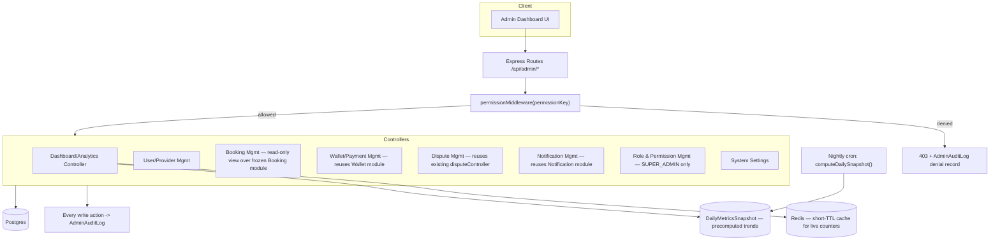

# Admin Dashboard & Analytics Module — Architecture & Design (কোড এখনো নেই)

## ⚠️ বর্তমান অবস্থা — গুরুত্বপূর্ণ আবিষ্কার
পুরো codebase-এ grep করে দেখলাম:

1. **RBAC এখন পর্যন্ত নেই।** `Role` enum-এ শুধু `CUSTOMER`/`PROVIDER`/`ADMIN` — admin হলেই সব কিছু করা যায় (`requireRole('ADMIN')`, flat, granularity নেই)। বর্তমান admin endpoint-গুলো ছড়িয়ে আছে ৪টা ভিন্ন controller-এ (`adminController.js`, `walletAdminController.js`, `notificationAdminController.js`, `reconciliationAdminController.js`, `disputeController.js`) — সবগুলোই একই flat `adminOnly` middleware ব্যবহার করে।
2. **কোনো centralized admin audit log নেই।** Suspend, verification approve, withdrawal process, dispute resolve, wallet adjustment — এই প্রতিটা action ইতিমধ্যে কোড-এ আছে, কিন্তু কোনোটাই কোথাও audit trail-এ লেখা হয় না।
3. **Dashboard/Analytics এখন পর্যন্ত শুধু বেসিক** (`getDashboardStats` — count-ভিত্তিক, trend/growth/retention কিছুই নেই)।

তাই এই মডিউল আসলে দুই কাজ করবে: (ক) নতুন Dashboard/Analytics/RBAC infrastructure বানানো, (খ) **বিদ্যমান, ইতিমধ্যে frozen ৪টা মডিউলের admin route-এ flat `requireRole('ADMIN')`-এর বদলে granular permission check বসানো** — এটা একটা বড় cross-cutting পরিবর্তন, সব ফাইলের route-guard লাইন বদলাবে (endpoint-এর URL/response format না, শুধু কে access পাবে তার নিয়ম) — শেষে approval-এর প্রশ্নে বিস্তারিত।

---

## ১. Architecture Diagram



**মূলনীতি:** এই মডিউল কোনো ব্যবসায়িক ডেটা-মডেল দখল করে না — Booking/Wallet/Payment/Notification module-এর উপর একটা **admin-facing view + action layer**। যেখানেই সম্ভব, বিদ্যমান controller function reuse করা হবে (যেমন dispute resolve আগে থেকেই আছে) — শুধু তার সামনে permission check ও পিছনে audit log যোগ হবে।

---

## ২. Database Schema

```prisma
enum AdminRole {
  SUPER_ADMIN
  ADMIN
  FINANCE_ADMIN
  SUPPORT_ADMIN
  MODERATOR
}

// User.role এখনো CUSTOMER/PROVIDER/ADMIN-ই থাকে (কোনো পরিবর্তন না) — এটা শুধু
// "কোন admin কোন tier" সেটা বলে, একটা আলাদা মাত্রা।
model AdminProfile {
  id              String    @id @default(uuid())
  userId          String    @unique
  user            User      @relation(fields: [userId], references: [id])
  adminRole       AdminRole
  isActive        Boolean   @default(true)
  createdByUserId String?   // কে এই admin access দিয়েছে — privilege-grant-এর নিজস্ব audit trail
  createdAt       DateTime  @default(now())
}

model Permission {
  id          String @id @default(uuid())
  key         String @unique // e.g. "users.suspend", "wallet.adjust", "disputes.resolve"
  description String
  category    String // "USER" | "PROVIDER" | "BOOKING" | "WALLET" | "PAYMENT" | "DISPUTE" | "NOTIFICATION" | "REPORTS" | "AUDIT" | "ROLE" | "SETTINGS"
}

model RolePermission {
  id           String     @id @default(uuid())
  adminRole    AdminRole
  permissionId String
  permission   Permission @relation(fields: [permissionId], references: [id])

  @@unique([adminRole, permissionId])
}

// প্রতিটা admin action-এর immutable রেকর্ড — requirement 5 ("audit every admin
// action") সরাসরি সমাধান করে, যেটা এখন কোথাও নেই।
model AdminAuditLog {
  id          String   @id @default(uuid())
  adminUserId String
  action      String   // "user.suspend", "withdrawal.approve", ইত্যাদি — Permission.key-এর সাথে মেলে
  targetType  String?  // "User" | "Booking" | "WithdrawalRequest" | "Dispute" ...
  targetId    String?
  beforeState Json?
  afterState  Json?
  ipAddress   String?
  userAgent   String?
  wasDenied   Boolean  @default(false) // permission check fail করলেও log হয় — privilege-escalation attempt ধরার জন্য
  createdAt   DateTime @default(now())

  @@index([adminUserId])
  @@index([action])
  @@index([targetType, targetId])
  @@index([createdAt])
}

// Analytics performance — raw table-এ প্রতিবার aggregate না করে, রাতে একবার
// snapshot নেওয়া হয়। Historical trend chart এখান থেকে পড়ে (দ্রুত), আজকের
// "live" সংখ্যা রিয়েল-টাইম কিন্তু Redis-এ ৬০s cache থাকে।
model DailyMetricsSnapshot {
  id                   String   @id @default(uuid())
  date                 DateTime @unique
  totalUsers           Int
  activeUsers          Int      // last 30 দিনে login করেছে
  totalProviders       Int
  activeProviders      Int      // status=ACTIVE
  pendingVerifications Int
  totalBookings        Int
  completedBookings    Int
  cancelledBookings    Int
  revenue              Float    // PLATFORM_COMMISSION ledger sum, ওই দিনের
  commission           Float
  refundAmount         Float
  newUsers             Int
  newProviders         Int
  createdAt            DateTime @default(now())
}
```

**User model-এ:** `adminProfile AdminProfile?` relation যোগ হবে (additive, breaking না)।

---

## ৩. Permission Matrix

R = দেখতে পারবে, W = অ্যাকশন নিতে পারবে, — = কিছুই না। (এটা `RolePermission` টেবিলে বাস্তবায়িত হবে, এখানে ডিজাইন-লেভেল সারসংক্ষেপ)

| Feature | Super Admin | Admin | Finance Admin | Support Admin | Moderator |
|---|---|---|---|---|---|
| Dashboard Overview | RW | R | R (financial widget) | R (ops widget) | R (সীমিত) |
| User Management | RW | RW | R | RW (শুধু suspend) | R |
| Provider Management | RW | RW | R | RW (verification) | RW (verification) |
| Booking Management | RW | RW | R | R | R |
| Wallet Management | RW | R | RW | R | — |
| Payment Management | RW | R | RW | R | — |
| Dispute Management | RW | RW | R | RW | RW |
| Notification Management | RW | RW | R | R | — |
| Reports & Analytics | RW | RW | RW (financial) | R (ops) | — |
| Audit Logs | R (সব) | R (নিজের scope) | R (financial actions) | R (নিজের actions) | — |
| Role & Permission Mgmt | RW | — | — | — | — |
| System Settings | RW | R | — | — | — |

**Privilege escalation প্রতিরোধ:** `Role & Permission Management`-এ শুধু `SUPER_ADMIN`-এর write access — কোনো `ADMIN`/অন্য tier নিজেকে বা অন্য কাউকে উচ্চতর role দিতে পারবে না (middleware-লেভেলে hard-coded, `RolePermission` টেবিলের মাধ্যমেও override করা যাবে না — এই একটা নিয়ম কোডে hardcoded থাকবে, ডেটাবেসে না, যাতে কেউ ভুলবশত/ইচ্ছাকৃতভাবে টেবিল এডিট করে নিজেকে SUPER_ADMIN বানাতে না পারে)।

---

## ৪. API List

| Method | Path | Permission |
|---|---|---|
| GET | `/api/admin/dashboard/overview` | `dashboard.view` |
| GET | `/api/admin/analytics/revenue?period=daily\|weekly\|monthly&from=&to=` | `reports.view` |
| GET | `/api/admin/analytics/bookings/trends` | `reports.view` |
| GET | `/api/admin/analytics/users/growth` | `reports.view` |
| GET | `/api/admin/analytics/providers/growth` | `reports.view` |
| GET | `/api/admin/analytics/categories/performance` | `reports.view` |
| GET | `/api/admin/analytics/cities` | `reports.view` |
| GET | `/api/admin/analytics/providers/top` | `reports.view` |
| GET | `/api/admin/analytics/retention` | `reports.view` |
| GET | `/api/admin/analytics/repeat-booking-rate` | `reports.view` |
| GET | `/api/admin/users?search=&status=&page=&limit=&sort=&export=csv` | `users.view` |
| PATCH | `/api/admin/users/:id/toggle-suspension` | `users.suspend` (বিদ্যমান, permission gate যোগ হবে) |
| GET | `/api/admin/providers?search=&city=&category=&status=` | `providers.view` |
| GET | `/api/admin/bookings?status=&city=&from=&to=&export=csv` | `bookings.view` |
| GET | `/api/admin/disputes` | `disputes.view` (বিদ্যমান `listOpenDisputes`) |
| PATCH | `/api/admin/disputes/:id/resolve` | `disputes.resolve` (বিদ্যমান) |
| GET | `/api/admin/withdrawals` | `wallet.view` (বিদ্যমান) |
| PATCH | `/api/admin/withdrawals/:id` | `wallet.approve` (বিদ্যমান) |
| POST | `/api/admin/wallet/adjustment` | `wallet.adjust` (বিদ্যমান) |
| GET | `/api/admin/audit-logs?adminUserId=&action=&from=&to=` | `audit.view` |
| GET | `/api/admin/roles` | `roles.manage` |
| PUT | `/api/admin/roles/:role/permissions` | `roles.manage` (SUPER_ADMIN hardcoded) |
| POST | `/api/admin/admins` (নতুন admin বানানো) | `roles.manage` (SUPER_ADMIN hardcoded) |
| POST | `/api/admin/broadcast` | `notifications.broadcast` |
| GET | `/api/admin/settings` | `settings.view` |
| PUT | `/api/admin/settings` | `settings.manage` |

Export (`?export=csv`) সব list endpoint-এ একই query param প্যাটার্নে সমর্থিত — আলাদা endpoint না বানিয়ে বিদ্যমান list endpoint-এর response format বদলে দেয়।

---

## ৫. Analytics Design

| Metric | উৎস | কীভাবে |
|---|---|---|
| Daily/Weekly/Monthly Revenue | `LedgerTransaction` (reason=PLATFORM_COMMISSION) | `DailyMetricsSnapshot` থেকে group-by-period sum |
| Booking Trends | `Booking.createdAt`/`status` | Snapshot-এর `totalBookings`/`completedBookings`/`cancelledBookings` |
| User/Provider Growth | `User.createdAt` | Snapshot-এর `newUsers`/`newProviders`, cumulative line chart |
| Category Performance | `Booking` join `ServiceListing.category` | Live query (category সংখ্যা কম, cache 5min) |
| City-wise Analytics | `Booking.latitude/longitude` বা `Address` reverse-geocoded city | ⚠️ বর্তমানে কোনো "city" field structured না — reverse-geocoding বা `Address`-এ city field যোগ করা লাগবে (ছোট User/Address module change, নিচে Open Decision-এ) |
| Top Providers | `Booking` group by provider, COMPLETED count/revenue | Live query, cache 1hr |
| Customer Retention | ২+ completed booking আছে এমন customer % | Snapshot-ভিত্তিক monthly cohort |
| Repeat Booking Rate | same customer একই provider-এ ২+ বার | Live query, cache 1hr |

**Caching:** Redis (ইতিমধ্যে provisioned) — "live" metrics ৬০s TTL, ভারী aggregation (top providers, retention) ১ ঘণ্টা TTL।

---

## ৬. Security Review

| # | ঝুঁকি | Mitigation |
|---|---|---|
| ১ | Privilege escalation | Role/Permission management শুধু `SUPER_ADMIN`, hardcoded (DB override দিয়ে বাইপাস করা যাবে না) |
| ২ | Audit log নেই (বর্তমান gap) | `AdminAuditLog` — প্রতিটা write action + **denied attempt-ও** লগ হবে |
| ৩ | flat `requireRole('ADMIN')` এখনো ৪টা module-এ | নতুন `permissionMiddleware(key)` দিয়ে replace — নিচে approval দরকার |
| ৪ | Export endpoint দিয়ে বাল্ক ডেটা exfiltration | Export-ও audit log হবে (কে, কখন, কী export করলো), rate-limited |
| ৫ | Broadcast notification abuse | শুধু নির্দিষ্ট permission, প্রতিটা broadcast আলাদাভাবে audit log হবে (কতজনকে, কী পাঠানো হলো) |

---

## ৭. Scalability Review

| বিষয় | ডিজাইন |
|---|---|
| Millions of users/bookings | সব list endpoint server-side paginated (cursor বা offset + max limit ৫০), search/filter/sort DB index-backed |
| Dashboard load latency | Live counter Redis cache (৬০s), historical trend precomputed `DailyMetricsSnapshot`-এ (raw table scan না) |
| Export CSV/Excel বড় dataset | Streaming export (row-by-row write, পুরো dataset মেমরিতে না আনা), বড় export background job হিসেবে (queue, ইমেইলে লিংক) বিবেচনা করা যায় ভবিষ্যতে |
| Audit log টেবিল বৃদ্ধি | Append-only, `(adminUserId)`, `(action)`, `(createdAt)` index; কয়েক মাস পর cold storage-এ archive করা যায় |

---

## ৮. Production Readiness Review

**এই design অনুযায়ী implement হলে যা থাকবে:** RBAC, centralized audit trail, cached+precomputed analytics, export, existing module reuse (duplicate business logic নেই)।

**Known limitation যেটা flag করছি:** City-wise analytics-এর জন্য structured city ডেটা এখন নেই — এটা resolve করতে হয় Address model-এ city field যোগ (ছোট, non-breaking) অথবা on-the-fly reverse geocoding (ধীর, বাহ্যিক API নির্ভর) দিয়ে।

---

## Approval-এর জন্য সিদ্ধান্ত দরকার

1. **সবচেয়ে বড়টা:** `adminController.js`, `walletAdminController.js`, `notificationAdminController.js`, `reconciliationAdminController.js`, `disputeController.js`-এর admin route-গুলোতে flat `requireRole('ADMIN')`-এর বদলে নতুন `permissionMiddleware(key)` বসানোর অনুমতি — এটা প্রতিটা আগের "frozen module"-কে সামান্য টাচ করবে (route-guard লাইন, business logic না), Wallet Module-এর `walletService.js` টাচ করার মতোই একটা category-র পরিবর্তন
2. City-wise analytics-এর জন্য `Address` model-এ `city String?` field যোগ করব (ছোট, additive, User/Booking module-এর behavior বদলাবে না)?
3. আগে থেকে থাকা একমাত্র admin (seed data-র `Admin` ইউজার)-কে কোন `AdminRole` দেব — `SUPER_ADMIN` ধরে নিচ্ছি, ঠিক আছে তো?
