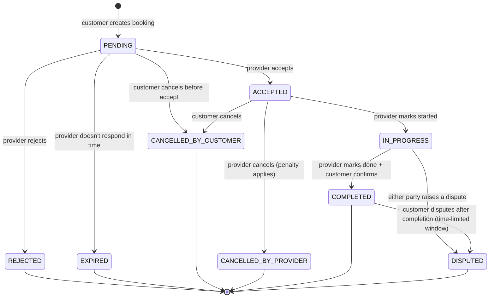
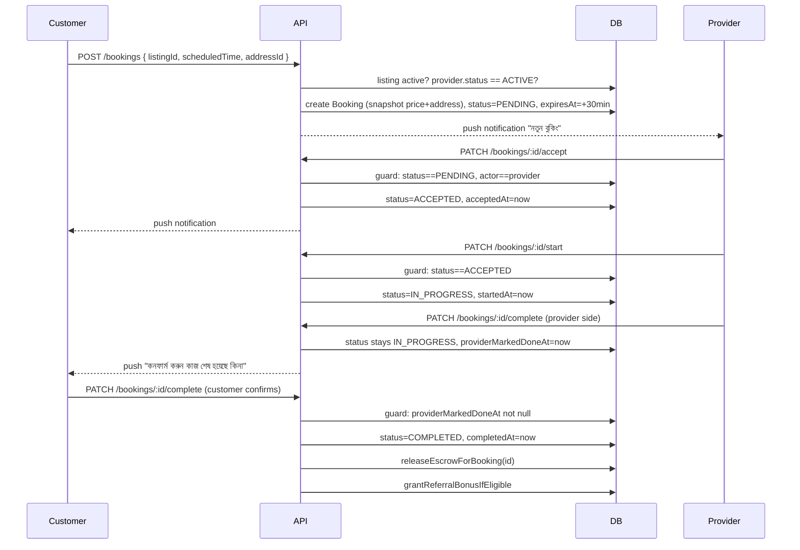

# Booking Module — Architecture & Design (এখনো কোড হয়নি — approval-এর অপেক্ষায়)

## ⚠️ গুরুত্বপূর্ণ প্রেক্ষাপট
`bookingController.js`/`bookingRoutes.js` ইতিমধ্যে আছে (create, accept/reject, reschedule, recurring, escrow release, referral bonus wired)। এই ডকুমেন্ট greenfield design না — **audit + redesign**। Critical Security Review সেকশনে বর্তমান কোডে পাওয়া গুরুতর সমস্যাগুলো আলাদা করে দেখানো হলো।

---

## ১. Database Schema (প্রস্তাবিত)

### Address (নতুন)
```
model Address {
  id          String   @id @default(uuid())
  userId      String
  user        User     @relation(fields: [userId], references: [id])
  label       String?           // "Home", "Work"
  addressLine String
  latitude    Float
  longitude   Float
  isDefault   Boolean  @default(false)
  deletedAt   DateTime?
  createdAt   DateTime @default(now())

  @@index([userId])
}
```

### ProviderProfile (পরিবর্তন)
```
status    ProviderStatus @default(PENDING_VERIFICATION)
isOnline  Boolean        @default(false)
deletedAt DateTime?
```
```
enum ProviderStatus { PENDING_VERIFICATION  ACTIVE  SUSPENDED  INACTIVE }
```

### ServiceListing (পরিবর্তন)
```
deletedAt DateTime?
```

### Booking (redesign)
```
model Booking {
  id                 String   @id @default(uuid())
  customerId         String
  customer           User     @relation("CustomerBookings", fields: [customerId], references: [id])
  providerId         String
  provider           ProviderProfile @relation("ProviderBookings", fields: [providerId], references: [id])
  listingId          String
  listing            ServiceListing @relation(fields: [listingId], references: [id])

  status             BookingStatus @default(PENDING)
  bookingType        BookingType @default(SCHEDULED)
  scheduledTime      DateTime
  isRecurring        Boolean  @default(false)
  recurrenceRule     String?

  // Snapshots — captured once at creation, never live-joined, so later
  // address/listing edits never silently change booking history
  serviceAddress     String
  latitude           Float
  longitude          Float
  agreedPrice        Float   // matches existing convention (Payment/Wallet also use Float, not Decimal)

  // Lifecycle audit trail
  acceptedAt         DateTime?
  rejectedAt          DateTime?
  startedAt          DateTime?
  completedAt        DateTime?
  cancelledAt        DateTime?
  cancelledByUserId  String?
  cancellationReason String?
  expiresAt          DateTime?   // provider auto-response deadline

  createdAt          DateTime @default(now())
  updatedAt          DateTime @updatedAt

  review             Review?
  messages           Message[]
  payment            Payment?

  @@index([customerId])
  @@index([providerId])
  @@index([status])
  @@index([scheduledTime])
}
```
```
enum BookingStatus {
  PENDING
  ACCEPTED
  REJECTED
  IN_PROGRESS
  COMPLETED
  CANCELLED_BY_CUSTOMER
  CANCELLED_BY_PROVIDER
  EXPIRED
  DISPUTED
}
```
**Breaking change নোট:** পুরনো `CANCELLED` single value দুইটা হয়ে যাচ্ছে (`CANCELLED_BY_CUSTOMER`/`CANCELLED_BY_PROVIDER`) — analytics/wallet/payment কোথাও string হিসেবে hardcoded `'CANCELLED'` চেক করা থাকলে migration-এর সময় সেসব খুঁজে বদলাতে হবে (`walletService.js`-এর `refundEscrowForBooking` কল করে দেখতে হবে)।

---

## ২. Booking State Machine



**Transition rules (who can trigger what) — এটাই বর্তমান কোডের সবচেয়ে বড় gap, নিচে Security Review-এ বিস্তারিত:**

| From → To | কে করতে পারবে |
|---|---|
| PENDING → ACCEPTED/REJECTED | শুধু provider |
| PENDING → CANCELLED_BY_CUSTOMER | শুধু customer |
| PENDING → EXPIRED | সিস্টেম (cron/scheduled job), মানুষ না |
| ACCEPTED → IN_PROGRESS | শুধু provider |
| ACCEPTED → CANCELLED_* | customer বা provider, যে যার নিজের ID-তে |
| IN_PROGRESS → COMPLETED | **provider মার্ক করবে "done", কিন্তু escrow release হবে customer confirm করলে বা এক নির্দিষ্ট সময় পর auto** — শুধু provider-এর একতরফা mark-এ escrow release করা যাবে না (fraud risk) |
| যেকোনো active state → DISPUTED | customer বা provider |

---

## ৩. API List

| Method | Path | Auth | নোট |
|---|---|---|---|
| POST | `/api/bookings` | customer, blockGuest | create — এখন address+price snapshot নেয়, provider status ACTIVE কিনা check করে |
| GET | `/api/bookings/me` | any | paginated (বর্তমানে নেই — যোগ হবে) |
| GET | `/api/bookings/:id` | participant only | নতুন — একক বুকিং-এর ডিটেইল (বর্তমানে নেই) |
| PATCH | `/api/bookings/:id/accept` | provider only | নতুন — স্পষ্ট endpoint, generic status PATCH-এর বদলে |
| PATCH | `/api/bookings/:id/reject` | provider only | নতুন |
| PATCH | `/api/bookings/:id/start` | provider only | নতুন — IN_PROGRESS |
| PATCH | `/api/bookings/:id/complete` | provider marks, customer confirms (২-ধাপ) | redesigned |
| PATCH | `/api/bookings/:id/cancel` | participant, নিজের role অনুযায়ী reason সহ | redesigned (আলাদা customer/provider cancel reason) |
| PATCH | `/api/bookings/:id/reschedule` | participant | বিদ্যমান, keep |
| POST | `/api/bookings/:id/dispute` | participant | নতুন, `Dispute` model already আছে কিন্তু booking-এর সাথে wire করা নেই |

**কেন generic `PATCH /:id/status` ভেঙে আলাদা endpoint করছি:** প্রতিটা transition-এর permission/side-effect আলাদা (accept-এ শুধু provider, cancel-এ reason লাগে, complete দুই-ধাপ) — একটা generic endpoint-এ এসব রুল if/else দিয়ে গুঁজলে bug-prone হয়, যেটা এখন হয়েছেও (নিচে দেখুন)।

---

## ৪. Sequence Diagram



---

## ৫. Event Flow

| Event | Trigger | Side-effects |
|---|---|---|
| `booking.created` | customer creates | push→provider |
| `booking.accepted` | provider accepts | push→customer, escrow already held from Payment (যদি upfront payment থাকে) |
| `booking.rejected` | provider rejects | push→customer, কোনো escrow ধরা থাকলে সাথে সাথে refund |
| `booking.started` | provider marks start | push→customer |
| `booking.completed` | দুই-ধাপ confirm শেষে | escrow release → provider wallet, referral bonus check, review-এর জন্য customer-কে prompt |
| `booking.cancelled` | যেকোনো পক্ষ | escrow refund (কে cancel করলো তার উপর penalty logic নির্ভর করতে পারে — future item) |
| `booking.expired` | cron job, PENDING + `expiresAt` পার হলে | push→customer "provider সাড়া দেয়নি" |
| `booking.disputed` | participant রিপোর্ট করলে | `Dispute` row তৈরি, escrow **freeze** (release/refund হোল্ড), admin queue-তে যোগ |
| `booking.recurring.next_created` | COMPLETED + isRecurring | পরের occurrence auto-তৈরি (বিদ্যমান লজিক রাখা হচ্ছে) |

**নতুন প্রয়োজন: EXPIRED handling-এর জন্য একটা cron/scheduled job** (এখনো প্রজেক্টে কোনো job scheduler নেই — `node-cron` বা external scheduler লাগবে, এটা implementation-এর সময় সিদ্ধান্ত লাগবে)।

---

## ৬. Security Review — বর্তমান কোডে পাওয়া সমস্যা

| # | সমস্যা | Severity | ব্যাখ্যা |
|---|---|---|---|
| ১ | **`updateBookingStatus`-এ কোনো state-machine enforcement নেই** — customer নিজেই নিজের বুকিং `COMPLETED` মার্ক করতে পারে | **Critical** | Customer PENDING/ACCEPTED অবস্থাতেই status=`COMPLETED` পাঠিয়ে escrow release করিয়ে নিতে পারবে, provider আসলেই কাজ করার আগেই টাকা পেয়ে যেতে পারে বা উল্টোটা — কাজ না করেই customer টাকা আটকে দিতে পারে |
| ২ | Provider নিজের ইচ্ছামতো `REJECTED` অবস্থা থেকে আবার `ACCEPTED`-এ, বা `COMPLETED` থেকে `CANCELLED`-এ যেতে পারে | High | কোনো "from state" চেক নেই কোডে |
| ৩ | Escrow release/refund কোনো transaction/lock ছাড়া হচ্ছে — দুইবার concurrent request পাঠালে double-release/double-refund হওয়ার সম্ভাবনা | High | Redesign-এ DB transaction + idempotency key লাগবে |
| ৪ | `createBooking` provider-এর `status`/`isSuspended`/availability কিছুই চেক করে না | Medium | Suspended provider-ও বুকিং পেয়ে যাচ্ছে |
| ৫ | Rate limiting নেই booking endpoint-এ | Low-Medium | একজন customer spam বুকিং পাঠিয়ে provider-কে notification-এ ডুবিয়ে দিতে পারে |

**Redesign-এ সমাধান:** প্রতিটা transition আলাদা endpoint + guard clause (`if (booking.status !== 'PENDING') return error(...)`), escrow-related transition-গুলো Prisma `$transaction` দিয়ে atomic করা, `createBooking`-এ provider.status/isOnline check যোগ।

---

## ৭. Scalability Review

| বিষয় | বর্তমান অবস্থা | সুপারিশ |
|---|---|---|
| `getMyBookings` | কোনো pagination নেই, সব বুকিং একসাথে লোড হয় | `take`/`skip` বা cursor-based pagination |
| N+1 query | `updateBookingStatus`-এ প্রতিটা notification পাঠানোর জন্য আলাদা `findUnique` কল হচ্ছে (provider+customer+recurring provider — ৩টা আলাদা query) | একটাই query-তে `include` দিয়ে দরকারি data একসাথে আনা |
| Recurring booking creation | Synchronous, request-এর মধ্যেই হচ্ছে | ভবিষ্যতে volume বাড়লে queue (BullMQ) দিয়ে async করা যায় — এখনই দরকার না, কিন্তু flag করে রাখলাম |
| Index | `Booking`-এ `customerId`/`providerId`/`status`-এর উপর explicit index নেই (Prisma FK auto-index করে না সবসময়) | schema-তে `@@index` যোগ করা হয়েছে (উপরে দেখুন) |
| Notification failure | `sendPushNotification` কল-গুলো `await` করা হচ্ছে না সবসময়, fire-and-forget — ভালো (booking flow notification-এর জন্য ব্লক হবে না), কিন্তু failure silently ignore হচ্ছে, কোনো retry/log নেই | Low priority — logging যোগ করা যায় |

---

## Open Decisions (implementation শুরুর আগে confirm করা দরকার)

1. **Escrow release-এর জন্য customer confirmation বাধ্যতামূলক করব, নাকি provider মার্ক করলেই ধরে নেব (X ঘণ্টা পর auto-confirm)?**
2. **EXPIRED status-এর জন্য cron job কীভাবে চালাব** — `node-cron` (same process) নাকি external scheduler (Redis-backed delayed job, e.g. BullMQ)?
3. **`CANCELLED` → দুইটা enum ভাঙার breaking change** — walletService/paymentController-এ কোথায় কোথায় প্রভাব পড়বে, migration-এর আগে পুরো codebase grep করে দেখাব।
