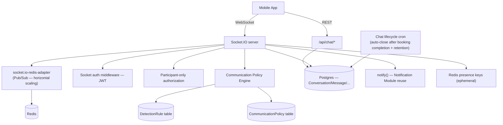
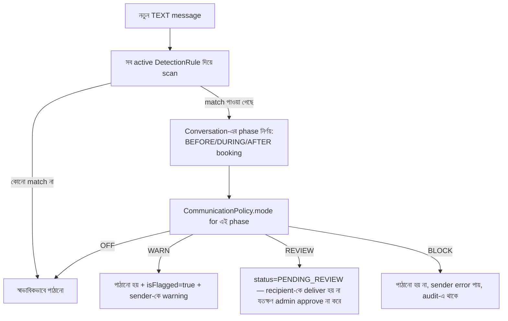
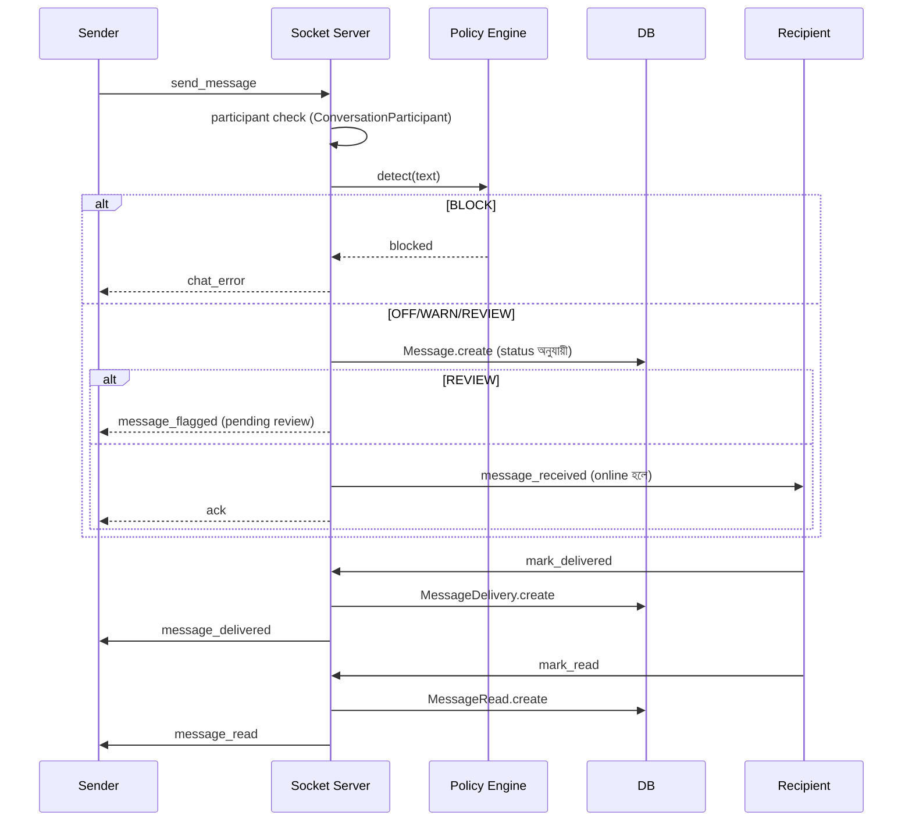
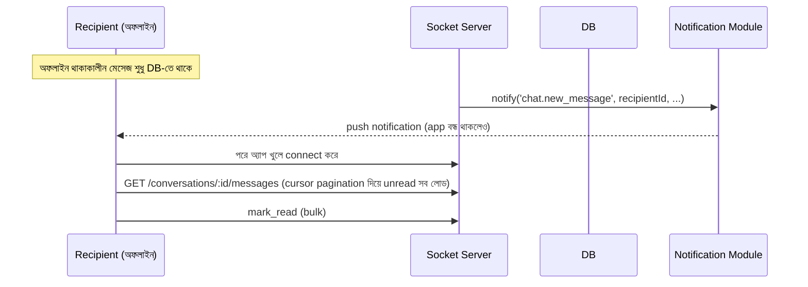

# Real-time Chat & Messaging Module — Architecture Design (কোড এখনো নেই)

## বর্তমান অবস্থা
`chatController.js`/`chatSocket.js`/`Message` model ইতিমধ্যে আছে — কিন্তু সেটা শুধু **booking-scoped 1:1 chat** (room = bookingId, `Message.bookingId` সরাসরি foreign key)। এতে নেই: Customer↔Support, Admin↔Customer/Provider chat type, delivery/read receipt আলাদা model, persisted presence/last-seen, rate limiting, communication policy, report/lock/archive। ফাইল আপলোডের জন্য `uploadChatMedia` multer middleware (mimetype whitelist, 20MB limit) **ইতিমধ্যে আছে ও reuse করা যাবে**।

এই ডিজাইন booking-bound room-এর বদলে একটা general-purpose **Conversation** abstraction-এ redesign করছে — যেটা Customer↔Provider (booking-linked)-এর পাশাপাশি Support/Admin chat-ও সমর্থন করবে।

**গুরুত্বপূর্ণ:** Booking module frozen বলে booking auto-start/auto-close লজিক **Booking module-এর কোনো ফাইল টাচ না করেই** ডিজাইন করা হয়েছে — Chat module শুধু `Booking.status`/`completedAt` **পড়ে** (read-only), কোনো wiring call booking controller-এ যোগ করা লাগছে না। তাই এই মডিউলের জন্য আগের মতো "frozen module touch" অনুমতি লাগছে না।

---

## ১. System Architecture



**মূলনীতি:** Notification Module-এর `notify()` reuse হবে push/in-app-এর জন্য (নতুন কিছু বানানো হবে না)। File validation-এর জন্য বিদ্যমান `uploadChatMedia` middleware reuse।

---

## ২. Database Schema

```prisma
enum ConversationType { CUSTOMER_PROVIDER  CUSTOMER_SUPPORT  ADMIN_CUSTOMER  ADMIN_PROVIDER }
enum ConversationStatus { ACTIVE  LOCKED  ARCHIVED }
enum ParticipantRole { CUSTOMER  PROVIDER  SUPPORT_AGENT  ADMIN }
enum MessageType { TEXT  IMAGE  DOCUMENT  VOICE  LOCATION }
enum MessageStatus { SENT  DELIVERED  READ  PENDING_REVIEW  BLOCKED }

model Conversation {
  id            String    @id @default(uuid())
  type          ConversationType
  bookingId     String?   @unique // শুধু CUSTOMER_PROVIDER-এর জন্য — lifecycle এখান থেকেই নির্ধারিত
  booking       Booking?  @relation(fields: [bookingId], references: [id])
  status        ConversationStatus @default(ACTIVE)
  lastMessageAt DateTime?
  createdAt     DateTime  @default(now())
  archivedAt    DateTime?
  lockedReason  String?

  participants  ConversationParticipant[]
  messages      Message[]

  @@index([type, status])
}

model ConversationParticipant {
  id             String    @id @default(uuid())
  conversationId String
  conversation   Conversation @relation(fields: [conversationId], references: [id])
  userId         String
  user           User      @relation(fields: [userId], references: [id])
  role           ParticipantRole
  lastReadAt     DateTime?
  isMuted        Boolean   @default(false)
  joinedAt       DateTime  @default(now())

  @@unique([conversationId, userId])
  @@index([userId])
}

model Message {
  id             String    @id @default(uuid())
  conversationId String
  conversation   Conversation @relation(fields: [conversationId], references: [id])
  senderId       String
  sender         User      @relation(fields: [senderId], references: [id])
  type           MessageType @default(TEXT)
  text           String?
  status         MessageStatus @default(SENT)
  isFlagged      Boolean   @default(false) // policy engine WARN/REVIEW hit
  createdAt      DateTime  @default(now())
  editedAt       DateTime?
  deletedAt      DateTime?

  attachments    MessageAttachment[]
  deliveries     MessageDelivery[]
  reads          MessageRead[]
  reports        MessageReport[]

  @@index([conversationId, createdAt]) // cursor pagination-এর মূল index
}

model MessageAttachment {
  id              String   @id @default(uuid())
  messageId       String
  message         Message  @relation(fields: [messageId], references: [id])
  url             String
  fileName        String?
  fileSizeBytes   Int?
  mimeType        String?
  durationSeconds Int?     // voice note
  latitude        Float?   // location share
  longitude       Float?
  createdAt       DateTime @default(now())
}

model MessageDelivery {
  id          String   @id @default(uuid())
  messageId   String
  message     Message  @relation(fields: [messageId], references: [id])
  userId      String   // recipient
  deliveredAt DateTime @default(now())

  @@unique([messageId, userId])
}

model MessageRead {
  id       String   @id @default(uuid())
  messageId String
  message   Message @relation(fields: [messageId], references: [id])
  userId    String
  readAt    DateTime @default(now())

  @@unique([messageId, userId])
}

enum ReportStatus { OPEN  REVIEWED  DISMISSED }

model MessageReport {
  id               String   @id @default(uuid())
  messageId        String
  message          Message  @relation(fields: [messageId], references: [id])
  reportedByUserId String
  reason           String
  status           ReportStatus @default(OPEN)
  reviewedByUserId String?
  reviewedAt       DateTime?
  createdAt        DateTime @default(now())

  @@index([status])
}

// --- Communication Policy Engine (requirement 12) ---

enum BookingPhase { BEFORE_BOOKING  DURING_BOOKING  AFTER_BOOKING }
enum PolicyMode { OFF  WARN  REVIEW  BLOCK }

model CommunicationPolicy {
  id              String     @id @default(uuid())
  phase           BookingPhase @unique
  mode            PolicyMode
  updatedAt       DateTime   @updatedAt
  updatedByUserId String?
}

enum DetectionRuleType { REGEX  CUSTOM_FUNCTION  ML_MODEL } // পরের দুটো reserved

// প্রতিটা detector একটা row — নতুন detection rule যোগ করতে কোড বদলানো লাগে না
model DetectionRule {
  id          String   @id @default(uuid())
  key         String   @unique // "phone_number" | "email" | "whatsapp_id" | ...
  type        DetectionRuleType @default(REGEX)
  pattern     String?  // REGEX টাইপের জন্য; CUSTOM_FUNCTION/ML_MODEL ভবিষ্যতে অন্য রেফারেন্স ব্যবহার করবে
  description String
  isActive    Boolean  @default(true)
  createdAt   DateTime @default(now())
}
```

**`User` model-এ additive:** `lastSeenAt DateTime?` — শুধু এইটুকু (online/offline লাইভ Redis-এ থাকে, DB-তে না, কারণ high-frequency data)।

---

## ৩. Communication Policy Engine — কীভাবে কাজ করে



- **Phase নির্ণয়:** `Conversation.bookingId` থাকলে সেই Booking-এর status দেখে (PENDING/ACCEPTED→BEFORE_BOOKING নাকি DURING_BOOKING সিদ্ধান্ত admin কনফিগার করবে ঠিক কোন booking status কোন phase-এ পড়ে — এটাও একটা mapping table/config হতে পারে, hardcoded না), COMPLETED+retention window-এর মধ্যে থাকলে AFTER_BOOKING। `bookingId` না থাকা conversation (Support/Admin chat)-এ একটা ডিফল্ট phase (কনফিগারযোগ্য) ব্যবহার হবে।
- **Extensibility:** নতুন detector (যেমন "bKash number", "crypto wallet address") যোগ করতে শুধু `DetectionRule` টেবিলে নতুন row — কোনো কোড ডিপ্লয় লাগে না (REGEX টাইপের জন্য)। ভবিষ্যতে ML-ভিত্তিক detector দরকার হলে `type=ML_MODEL` যোগ করে detection engine-এ একটা নতুন "strategy" রেজিস্টার করলেই হবে (plugin architecture, নিচে বিস্তারিত)।
- **Detection engine architecture:** `src/chat/policy/detectors/` — প্রতিটা `DetectionRuleType`-এর জন্য একটা module (`regexDetector.js` এখনই, `mlDetector.js`/`customFunctionDetector.js` পরে placeholder) — একটা registry pattern (Payment Reconciliation module-এর provider registry-র মতোই প্যাটার্ন) দিয়ে engine কোন detector চালাবে ঠিক করে।

---

## ৪. Booking Integration (frozen module টাচ ছাড়াই)

- **Chat শুরু:** Conversation lazily তৈরি হয় — customer/provider প্রথমবার chat খুলতে চাইলে, Chat module নিজেই `Booking.status` চেক করে (ACCEPTED বা তার পরের যেকোনো non-terminal state হলে allow, PENDING/REJECTED-এ block)। কোনো booking controller টাচ করা লাগে না।
- **Chat বন্ধ:** একটা cron job (Chat module-এর নিজস্ব, বাকি cron-গুলোর প্যাটার্নে) প্রতিদিন চেক করে — যে booking `COMPLETED` + `completedAt` + configurable retention period (যেমন ৭ দিন, `SystemSetting`-এ কনফিগারযোগ্য) পার হয়ে গেছে, তার Conversation `status=ARCHIVED` করে দেয়।
- **Booking ছাড়া chat করা যাবে না** (CUSTOMER_PROVIDER টাইপের জন্য) — Conversation তৈরির সময়েই bookingId বাধ্যতামূলক ও ownership check।

---

## ৫. WebSocket Event List

**Client → Server:**
| Event | Payload |
|---|---|
| `join_conversation` | `{ conversationId }` |
| `leave_conversation` | `{ conversationId }` |
| `send_message` | `{ conversationId, type, text?, attachmentId? }` |
| `typing` / `stop_typing` | `{ conversationId }` |
| `mark_delivered` | `{ messageId }` |
| `mark_read` | `{ conversationId, messageId }` |
| `heartbeat` | (presence keep-alive) |

**Server → Client:**
| Event | কখন |
|---|---|
| `message_received` | নতুন মেসেজ (participant room-এ broadcast) |
| `message_delivered` | recipient-এর client ack করলে |
| `message_read` | recipient read করলে |
| `message_flagged` | policy engine WARN/REVIEW হিট করলে (sender-কে) |
| `presence_update` | কেউ online/offline হলে |
| `typing` / `stop_typing` | |
| `conversation_locked` / `conversation_archived` | admin action বা auto-close |
| `chat_error` | validation/permission/policy-BLOCK ব্যর্থতা |

---

## ৬. REST API List

| Method | Path | নোট |
|---|---|---|
| GET | `/api/chat/conversations` | আমার conversation তালিকা, paginated |
| POST | `/api/chat/conversations/support` | নতুন Customer↔Support conversation শুরু |
| GET | `/api/chat/conversations/:id/messages?cursor=&limit=` | cursor-based pagination |
| POST | `/api/chat/conversations/:id/messages` | REST fallback (socket না থাকলে), attachment-সহ |
| POST | `/api/chat/upload` | বিদ্যমান `uploadChatMedia` middleware reuse |
| PATCH | `/api/chat/conversations/:id/read` | বাল্ক read (REST দিয়ে) |
| POST | `/api/chat/messages/:id/report` | অপব্যবহার রিপোর্ট |
| GET | `/api/admin/chat/conversations?type=&status=&search=` | admin lookup |
| GET | `/api/admin/chat/conversations/:id/messages` | **admin audit-logged access** — নিচে Security Review |
| GET | `/api/admin/chat/reports` | |
| PATCH | `/api/admin/chat/reports/:id` | review/dismiss |
| PATCH | `/api/admin/chat/conversations/:id/lock` | |
| PATCH | `/api/admin/chat/conversations/:id/archive` | |
| GET/PUT | `/api/admin/chat/policy` | `CommunicationPolicy` (phase-ভিত্তিক mode) |
| GET/POST/PATCH | `/api/admin/chat/detection-rules` | `DetectionRule` CRUD |

---

## ৭. Sequence Diagrams

### মেসেজ পাঠানো + delivery/read receipt


### Offline delivery


---

## ৮. Security Review

| # | বিষয় | Mitigation |
|---|---|---|
| ১ | শুধু participant-রা access করবে | প্রতিটা socket event ও REST endpoint-এ `ConversationParticipant` lookup — নেই মানে সরাসরি reject |
| ২ | File validation | বিদ্যমান `uploadChatMedia` (mimetype whitelist + 20MB limit) reuse |
| ৩ | Spam protection | Rate limiting (নিচে) + policy engine |
| ৪ | Rate limiting | `send_message`-এ per-user Redis-based limiter (যেমন ৩০ msg/মিনিট) — Auth module-এর rate limiter প্যাটার্ন reuse |
| ৫ | **Admin message audit** | Admin কোনো conversation-এর মেসেজ দেখলে সেটা নিজেই একটা sensitive action — Admin Dashboard module-এর বিদ্যমান `AdminAuditLog`/`permissionMiddleware('chat.view_messages')` দিয়ে gate করা হবে, প্রতিটা admin view logged (আইনি প্রয়োজনে audit trail থাকবে কে কখন কোন ব্যক্তিগত কথোপকথন দেখেছে) |
| ৬ | Socket auth | বিদ্যমান JWT-ভিত্তিক socket middleware pattern রাখা হচ্ছে |
| ৭ | Policy BLOCK bypass চেষ্টা (attachment দিয়ে contact info পাঠানো, যেমন ছবি তুলে ফোন নম্বর) | ⚠️ Text-only detection — image/OCR detection এই ডিজাইনের scope-এ নেই, ভবিষ্যতে `ML_MODEL` detector type দিয়ে যোগ করা যাবে (স্থাপত্য এটার জন্য প্রস্তুত, কিন্তু এখনই বানানো হচ্ছে না) |

---

## ৯. Scalability Review

| বিষয় | ডিজাইন |
|---|---|
| Horizontal scaling | `socket.io-redis-adapter` — একাধিক Node instance-এ Socket.IO রুম broadcast সমন্বিত থাকবে (Redis Pub/Sub) |
| Millions of messages | `Message`-এ `(conversationId, createdAt)` index, cursor-based pagination (offset না) |
| Presence at scale | Redis key per user (TTL-ভিত্তিক heartbeat), DB-তে না — লাইভ ডেটা DB-তে না রেখে scale-friendly |
| Message queue | ভারী async কাজ (push notification পাঠানো, media processing ভবিষ্যতে) BullMQ (Notification module-এ ইতিমধ্যে আছে) দিয়ে; মেসেজ delivery নিজেই socket-এর মাধ্যমে সরাসরি, queue-তে যাওয়ার দরকার নেই |
| Read receipt বাল্ক আপডেট | `mark_read`-এ একসাথে অনেকগুলো message আসলে bulk upsert, প্রতিটা আলাদা query না |

---

## ১০. Production Readiness Review

এই ডিজাইন implement হলে থাকবে: participant-authorized general-purpose messaging, delivery/read receipt, presence, extensible communication-policy engine, admin moderation tooling, horizontal-scale-ready socket layer। 

**Known limitation (honestly flagging):** Image/attachment-এর ভেতরের contact info (OCR) detect হবে না — শুধু text messages scan হয়। এটা architecture-কে ব্লক করছে না (ML_MODEL detector type reserved আছে), কিন্তু v1-এ কভার হচ্ছে না।

---

## সিদ্ধান্ত দরকার

1. **REVIEW mode-এর semantics:** message আটকে রাখা হবে (recipient না পাওয়া পর্যন্ত admin approve না করলে) — এটা ঠিক আছে, নাকি normal ভাবে deliver হয়ে যাবে আর শুধু admin queue-তে flag হবে (post-hoc review)?
2. Booking status থেকে phase mapping (কোন booking status BEFORE/DURING/AFTER-এ পড়বে) — একটা কনফিগারযোগ্য mapping টেবিল বানাব, নাকি simple hardcoded rule (PENDING/ACCEPTED=BEFORE, IN_PROGRESS=DURING, COMPLETED+retention=AFTER) দিয়ে শুরু করব?
3. Retention period ডিফল্ট কত দিন রাখব (chat archive হওয়ার আগে)?
