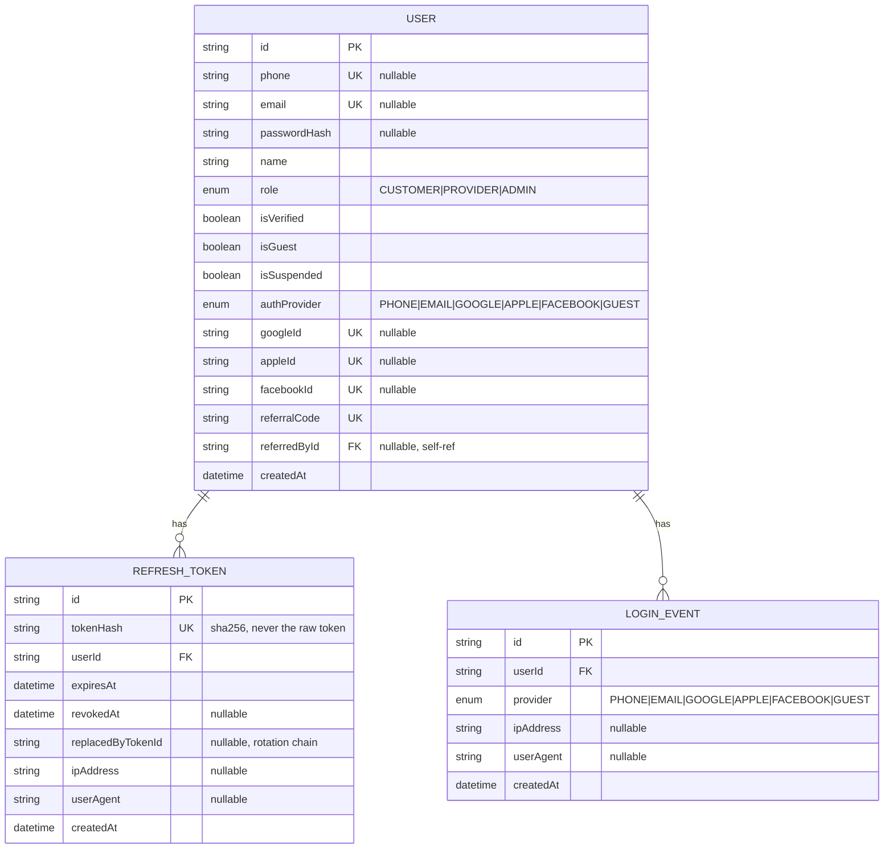

# Authentication — ER Diagram

Scope: only the entities/fields relevant to the Authentication module. `User`
has many more fields/relations used by other modules (Booking, Wallet,
etc.) — omitted here for clarity.

**নোট:**
- OTP নিজে কোনো table না — Redis-এ থাকে (`otp:hash:{phone}`, `otp:attempts:{phone}`), TTL দিয়ে auto-expire হয়, তাই ER diagram-এ নেই।
- `RefreshToken` স্বয়ংসম্পূর্ণ audit trail: `replacedByTokenId` দিয়ে পুরো rotation chain ট্রেস করা যায়, token theft হলে কোন chain থেকে হয়েছে বোঝা যাবে।
