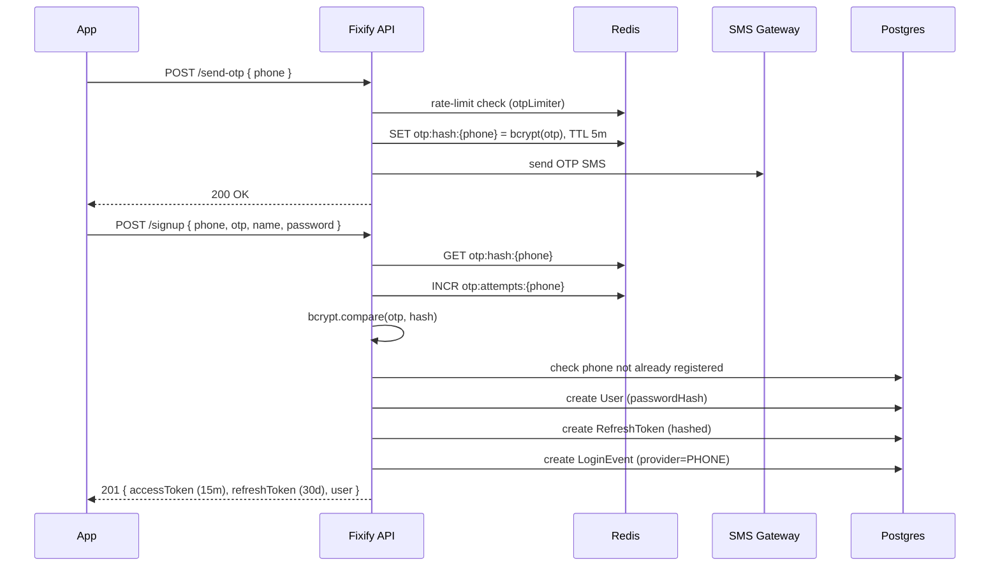
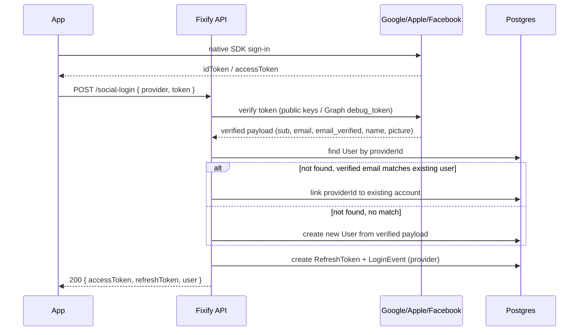
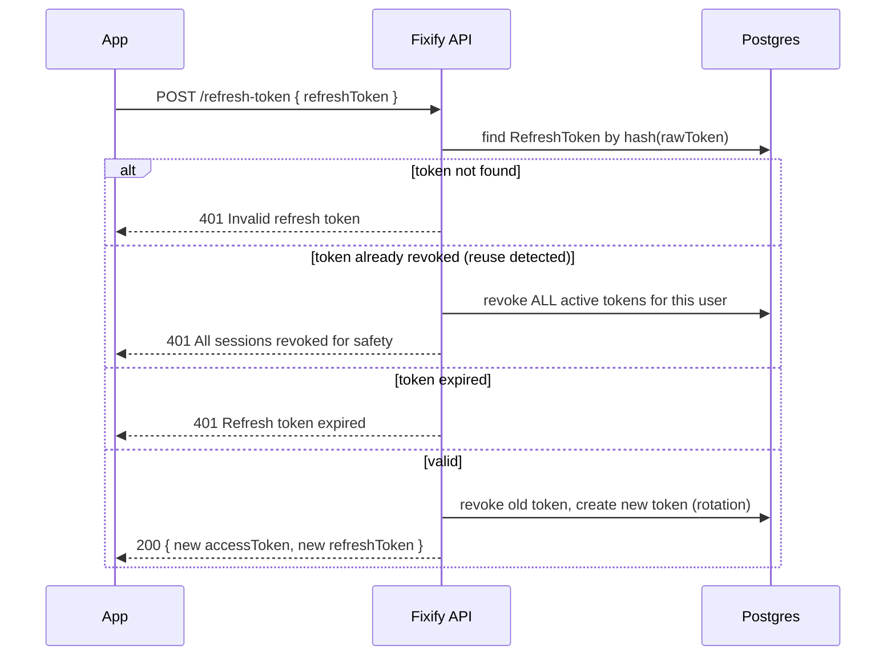

# Authentication — Sequence Diagrams

## 1. Phone OTP Signup + Login

```mermaid
sequenceDiagram
    participant App
    participant API as Fixify API
    participant Redis
    participant SMS as SMS Gateway
    participant DB as Postgres

    App->>API: POST /send-otp { phone }
    API->>Redis: rate-limit check (otpLimiter)
    API->>Redis: SET otp:hash:{phone} = bcrypt(otp), TTL 5m
    API->>SMS: send OTP SMS
    API-->>App: 200 OK

    App->>API: POST /signup { phone, otp, name, password }
    API->>Redis: GET otp:hash:{phone}
    API->>Redis: INCR otp:attempts:{phone}
    API->>API: bcrypt.compare(otp, hash)
    API->>DB: check phone not already registered
    API->>DB: create User (passwordHash)
    API->>DB: create RefreshToken (hashed)
    API->>DB: create LoginEvent (provider=PHONE)
    API-->>App: 201 { accessToken (15m), refreshToken (30d), user }
```

## 2. Social Login (Google / Apple / Facebook)

```mermaid
sequenceDiagram
    participant App
    participant API as Fixify API
    participant Provider as Google/Apple/Facebook
    participant DB as Postgres

    App->>Provider: native SDK sign-in
    Provider-->>App: idToken / accessToken
    App->>API: POST /social-login { provider, token }
    API->>Provider: verify token (public keys / Graph debug_token)
    Provider-->>API: verified payload (sub, email, email_verified, name, picture)
    API->>DB: find User by providerId
    alt not found, verified email matches existing user
        API->>DB: link providerId to existing account
    else not found, no match
        API->>DB: create new User from verified payload
    end
    API->>DB: create RefreshToken + LoginEvent (provider)
    API-->>App: 200 { accessToken, refreshToken, user }
```

## 3. Refresh Token Rotation (incl. theft detection)

```mermaid
sequenceDiagram
    participant App
    participant API as Fixify API
    participant DB as Postgres

    App->>API: POST /refresh-token { refreshToken }
    API->>DB: find RefreshToken by hash(rawToken)
    alt token not found
        API-->>App: 401 Invalid refresh token
    else token already revoked (reuse detected)
        API->>DB: revoke ALL active tokens for this user
        API-->>App: 401 All sessions revoked for safety
    else token expired
        API-->>App: 401 Refresh token expired
    else valid
        API->>DB: revoke old token, create new token (rotation)
        API-->>App: 200 { new accessToken, new refreshToken }
    end
```
