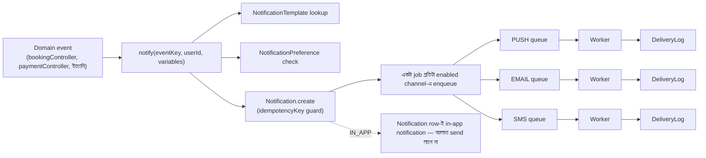
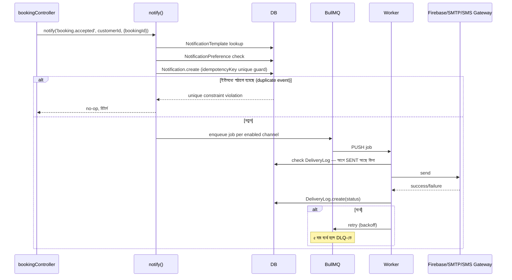

# Notification Module — Architecture Design (কোড এখনো নেই — approval-এর অপেক্ষায়)

## বর্তমান অবস্থা
এই মডিউলটা আসলেই fresh — এখন পর্যন্ত কোনো `Notification` মডেল নেই, push notification-ও সরাসরি `sendPushNotification()` কল করে fire-and-forget (কোনো DB record, retry, dedup, বা in-app history ছাড়া)। Email/SMS-এর raw sender ফাংশন (`emailService.js`, `smsService.js`) আছে কিন্তু কোনো "notification" abstraction-এর সাথে যুক্ত না — শুধু OTP পাঠাতে ব্যবহৃত হচ্ছে এখন পর্যন্ত। তাই এটা সত্যিকারের greenfield design।

---

## ১. Database Schema

```prisma
enum NotificationChannel { PUSH EMAIL SMS IN_APP }
enum NotificationCategory { BOOKING PAYMENT WALLET VERIFICATION SECURITY SYSTEM }
enum DeliveryStatus { QUEUED SENT DELIVERED FAILED RETRYING DEAD_LETTER }

model NotificationTemplate {
  id                    String   @id @default(uuid())
  key                   String   @unique // event name, e.g. "booking.created"
  category              NotificationCategory
  channels              NotificationChannel[] // এই event ডিফল্টে কোন কোন চ্যানেলে যায়
  titleTemplate         String?  // push/in-app — {{variable}} interpolation
  bodyTemplate          String
  emailSubjectTemplate  String?
  emailBodyTemplate     String?  // HTML
  smsTemplate           String?
  isActive              Boolean  @default(true)
  createdAt             DateTime @default(now())
  updatedAt             DateTime @updatedAt
}

model NotificationPreference {
  id           String               @id @default(uuid())
  userId       String
  user         User                 @relation(fields: [userId], references: [id])
  category     NotificationCategory
  pushEnabled  Boolean              @default(true)
  emailEnabled Boolean              @default(true)
  smsEnabled   Boolean              @default(false) // খরচের কারণে ডিফল্ট বন্ধ, ইউজার চাইলে চালু করবে
  inAppEnabled Boolean              @default(true)
  updatedAt    DateTime             @updatedAt

  @@unique([userId, category])
}

// এক event = এক Notification row (idempotency-এর মূল unit)
model Notification {
  id              String    @id @default(uuid())
  userId          String
  user            User      @relation(fields: [userId], references: [id])
  templateKey     String
  category        NotificationCategory
  title           String
  body            String
  data            Json?     // deep-link payload — bookingId ইত্যাদি
  isRead          Boolean   @default(false)
  readAt          DateTime?
  scheduledFor    DateTime? // null মানে সাথে সাথে
  idempotencyKey  String    @unique // dedup guard — Security Review-এ বিস্তারিত
  createdAt       DateTime  @default(now())

  deliveryLogs    NotificationDeliveryLog[]

  @@index([userId, isRead])
  @@index([scheduledFor])
  @@index([category])
}

// এক Notification-এর প্রতিটা চ্যানেলে প্রতিটা attempt = এক row (audit trail)
model NotificationDeliveryLog {
  id               String         @id @default(uuid())
  notificationId   String
  notification     Notification   @relation(fields: [notificationId], references: [id])
  channel          NotificationChannel
  status           DeliveryStatus
  attempt          Int            @default(1)
  providerResponse Json?
  errorMessage     String?
  sentAt           DateTime?
  deliveredAt      DateTime?
  createdAt        DateTime       @default(now())

  @@index([notificationId, channel])
  @@index([status])
}
```

---

## ২. Event Flow



**গুরুত্বপূর্ণ ডিজাইন সিদ্ধান্ত:** Booking/Payment/Wallet module-এর ভেতরে সরাসরি `sendPushNotification()` কল করার বদলে, এখন থেকে সব জায়গায় একটাই entry point — `notify(eventKey, userId, variables)`। এটা Booking/Payment/Wallet module-এর ভেতরের কোড সামান্য বদলাবে (সরাসরি push কলের বদলে `notify()` কল) — কিন্তু বাইরের behavior (কে কী notification পায়) অপরিবর্তিত থাকবে, শুধু delivery-টা reliable হবে।

---

## ৩. Queue Design

**সুপারিশ: BullMQ** (Redis-ভিত্তিক — Auth module থেকেই Redis provisioned আছে, নতুন infra লাগবে না)।

- প্রতি channel-এর জন্য আলাদা queue (`notifications:push`, `notifications:email`, `notifications:sms`) — যাতে ধীরগতির SMS গেটওয়ে push notification-কে block না করে
- Concurrency per queue: PUSH উচ্চ (৫০), EMAIL মাঝারি (১০, SMTP rate limit), SMS কম (৫, গেটওয়ে rate limit অনুযায়ী)
- **Retry:** ৫ বার, exponential backoff (৩০s, ১মি, ২মি, ৪মি, ৮মি)
- **Dead Letter Queue:** ৫ বার ব্যর্থ হলে `notifications:dlq` নামের আলাদা queue-তে চলে যায় — admin endpoint দিয়ে দেখা ও ম্যানুয়াল retry করা যাবে
- **Scheduled notifications:** BullMQ-র built-in delayed job (`delay` option, `scheduledFor - now` থেকে হিসাব) — আলাদা polling দরকার নেই

**একটা স্থাপত্য সিদ্ধান্ত লাগবে:** Worker কি API server-এর একই process-এ চলবে (এখনকার cron job-গুলোর মতো — সহজ, কিন্তু notification worker crash করলে API-ও প্রভাবিত হতে পারে), নাকি আলাদা process (`node worker.js`, আলাদাভাবে deploy/scale করা যায়, কিন্তু deployment জটিলতা বাড়ে)?

---

## ৪. User Preferences ও Category

প্রতি `(userId, category)` জোড়ার জন্য একটা preference row। বিশেষ নিয়ম: **`SECURITY` ক্যাটাগরির জন্য preference update-এ কমপক্ষে একটা চ্যানেল (PUSH বা EMAIL) বন্ধ করা যাবে না** — নিরাপত্তা সতর্কতা সম্পূর্ণ বন্ধ করে দেওয়ার সুযোগ দেওয়া ঠিক হবে না (validation-এ reject করা হবে)।

---

## ৫. Event-Driven Notifications (১০টা)

| Event | প্রাপক | চ্যানেল | Category |
|---|---|---|---|
| Booking Created | Provider | PUSH, IN_APP | BOOKING |
| Booking Accepted | Customer | PUSH, IN_APP | BOOKING |
| Provider Arrived | Customer | PUSH, IN_APP, SMS | BOOKING |
| Job Started | Customer | PUSH, IN_APP | BOOKING |
| Job Completed | উভয়ে | PUSH, IN_APP, EMAIL | BOOKING |
| Payment Successful | Customer | PUSH, IN_APP, EMAIL | PAYMENT |
| Refund Processed | Customer | PUSH, IN_APP, EMAIL | PAYMENT |
| Withdrawal Approved | Provider | PUSH, IN_APP, EMAIL, SMS | WALLET |
| Account Verification | ইউজার | PUSH, IN_APP, EMAIL | VERIFICATION |
| Security Alert | ইউজার | PUSH, IN_APP, EMAIL, SMS | SECURITY (override-immune) |

---

## ৬. API List

| Method | Path | নোট |
|---|---|---|
| GET | `/api/notifications/me` | paginated, `?category=`/`?isRead=` filter |
| PATCH | `/api/notifications/:id/read` | |
| PATCH | `/api/notifications/read-all` | |
| GET | `/api/notifications/preferences` | সব category-র preference |
| PUT | `/api/notifications/preferences` | bulk update |
| POST | `/api/notifications/device-token` | বিদ্যমান (`registerDeviceToken`), রাখা হচ্ছে |
| GET | `/api/admin/notifications/templates` | |
| POST/PATCH | `/api/admin/notifications/templates/:key` | |
| GET | `/api/admin/notifications/dlq` | Dead-letter queue browse |
| POST | `/api/admin/notifications/dlq/:id/retry` | |

---

## ৭. Sequence Diagram



---

## ৮. Security Review

| # | ঝুঁকি | Mitigation |
|---|---|---|
| ১ | Duplicate notification (একই event দুইবার fire) | `Notification.idempotencyKey` unique constraint (event-level) |
| ২ | Duplicate send (retry-তে একই channel-এ দুইবার পাঠানো) | Worker send করার আগে DeliveryLog-এ আগে থেকে SENT/DELIVERED আছে কিনা check করে (channel-level idempotency) |
| ৩ | Push payload-এ sensitive data (OTP, ফুল অ্যাকাউন্ট ডিটেইল) | Template design guideline: push/SMS body-তে কখনো sensitive data রাখা হবে না, শুধু "কিছু একটা হয়েছে, app খুলুন" স্টাইল + `data` payload-এ শুধু id (deep-link-এর জন্য) |
| ৪ | Stale/invalid FCM token | Worker FCM-এর `NotRegistered`/`InvalidArgument` error পেলে ইউজারের `fcmToken` null করে দেবে (এখনকার `sendPushNotification`-এ এটা নেই — নতুন worker-এ যোগ হবে) |
| ৫ | Email template-এ HTML injection | Interpolation করার সময় সব variable HTML-escape করা হবে (`name` ফিল্ডে কেউ `<script>` দিলে যেন email-এ execute না হয়) |
| ৬ | Audit log | প্রতিটা send attempt-ই `NotificationDeliveryLog`-এ — কিছুই untracked যাবে না |

---

## ৯. Scalability Review

| বিষয় | ডিজাইন |
|---|---|
| Millions of notifications | `Notification`-এ `(userId, isRead)`, `(scheduledFor)`, `(category)` index; `DeliveryLog`-এ `(notificationId, channel)`, `(status)` |
| Worker horizontal scale | BullMQ worker stateless — একাধিক process/instance একই Redis queue consume করতে পারে, সরাসরি scale out |
| Channel isolation | আলাদা queue per channel — ধীরগতির SMS গেটওয়ে push throughput-কে block করে না |
| Bulk/broadcast (ভবিষ্যতে) | এই ১০টা event সবই single-user; broadcast-টাইপ ফিচার (যেমন "সব ইউজারকে জানান") ভবিষ্যতে দরকার হলে bulk-insert + bulk-enqueue আলাদাভাবে ডিজাইন করতে হবে — এখনই দরকার নেই |
| পুরনো ডেটা | `Notification`/`DeliveryLog` টেবিল কখনো ছোট হবে না (audit প্রয়োজন) — কয়েক মাস পর archiving/partitioning বিবেচনা করা যায়, এখনই দরকার না |
| Read-heavy `GET /notifications/me` | Cursor/offset paginated, index-backed |

---

## সিদ্ধান্ত দরকার

1. **Worker process:** API-র সাথে একই process, নাকি আলাদা deployable process?
2. Existing module-গুলোর (Booking, Payment, Wallet) ভেতরের সরাসরি `sendPushNotification()` কল-গুলো `notify()`-দিয়ে replace করব — এটা Booking module "frozen" নিয়মের ব্যতিক্রম হিসেবে অনুমতি লাগবে (আগের মতোই, শুধু internal wiring বদলাবে, behavior/API না)
