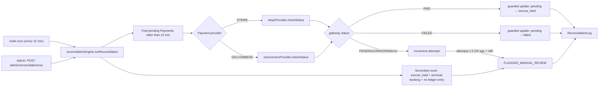

# Payment Reconciliation System

## Design Overview
Provider-agnostic core (`reconciliationEngine.js`) + one module per gateway (`providers/stripeProvider.js`, `providers/sslcommerzProvider.js`), each exporting the same `{ name, checkStatus(payment) }` shape. The engine never contains gateway-specific code — adding a new provider (e.g. bKash, Nagad) later means writing one new file matching that interface and registering it in `src/services/reconciliation/index.js`. Nothing else changes.



## Scheduling Strategy
**Every 15 minutes**, via `node-cron` in-process (matches the existing `bookingExpiryJob` pattern — same single-instance caveat is documented there and applies here too; see "Open Decisions" in `docs/booking-module-design.md`).

Why 15 minutes: a **10-minute grace period** is applied before a `pending` payment is even considered (normal webhook delivery is usually seconds, occasionally a couple of minutes — 10 minutes avoids false-positives on in-flight payments). 15-minute polling means a genuinely missed webhook is caught within ~25 minutes worst case, without hammering Stripe/SSLCommerz's rate-limited status-lookup endpoints with a tighter loop.

## Retry Policy
- Per-payment `reconciliationAttempts` counter, incremented every time a check comes back inconclusive (still pending at gateway, gateway error, or an unrecognized status).
- **5 attempts** (≈ over 75 minutes of 15-min cycles) before a payment is flagged `FLAGGED_MANUAL_REVIEW`.
- **Hard ceiling: 48 hours** — regardless of attempt count, a payment still unresolved after 48h is flagged, since something is clearly wrong (stuck integration, gateway outage, etc.) and deserves a human look rather than infinite silent retries.
- Every attempt (success, failure, or inconclusive) is logged to `ReconciliationLog` — nothing is retried silently without a trace.

## Idempotency (requirement 5)
Two layers, matching the pattern from the earlier financial-consistency refactor:
1. **Guarded `updateMany`** — `payment.updateMany({ where: { status: 'pending' }, ... })` only ever succeeds once. Running reconciliation twice (cron overlap, manual trigger racing the cron, etc.) on the same payment is a safe no-op the second time (`MATCHED_NO_ACTION`).
2. **`LedgerEntry`'s unique(bookingId, type) constraint** — the actual money movement (escrow release/refund, wallet credit, commission) still goes through `walletService.js`'s existing atomic functions, which have their own independent idempotency guard. Reconciliation never bypasses that — it only fixes `Payment.status`, then the normal booking lifecycle (still requires the customer to confirm completion) handles the money movement exactly as it would have if the webhook had arrived on time.

## Audit Logging (requirement 6)
Every reconciliation action — matched-no-action, marked-escrow-held, marked-failed, flagged-for-review, or error — writes one `ReconciliationLog` row: previous status, new status, raw gateway status, and a human-readable detail string. Nothing is silently skipped.

## Partial Failure Handling (requirement 7)
`runReconciliation()` loops over all candidate payments with a `try/catch` around each one individually. One payment throwing an unexpected error (network blip, malformed gateway response, etc.) is logged and added to the report's `errors` array — it never stops the rest of the batch from being processed.

## Report (requirement 8)
`runReconciliation()` returns:
```
{
  startedAt, finishedAt, totalChecked,
  reconciledPaid: [paymentId, ...],
  reconciledFailed: [paymentId, ...],
  manualReviewQueue: [paymentId, ...],
  errors: [{ paymentId, message }, ...],
}
```
Available two ways:
- **Cron log line** every 15 minutes (`[reconciliationJob] checked=... paid=... failed=... manualReview=... errors=...`)
- **On demand**: `POST /api/admin/reconciliation/run` (admin-only, returns the full report immediately)
- **Manual review queue browsing**: `GET /api/admin/reconciliation/queue` (paginated, joins Payment+Booking) and `PATCH /api/admin/reconciliation/queue/:id/resolve` to clear an item after a human handles it

## Monitoring Approach
Currently: structured `console.log`/`console.warn` lines (matches the rest of this codebase's logging — see the earlier deployment checklist's noted gap: no centralized log aggregation is set up yet). Once that's in place, these log lines are already structured enough to alert on directly (e.g. "`manualReview=` > 0" or "`errors=` > 0" as an alert condition). The admin queue endpoints mean reconciliation health doesn't strictly depend on log monitoring either — an ops dashboard could poll `GET /api/admin/reconciliation/queue` directly.

## Adding a New Payment Provider
1. Create `src/services/reconciliation/providers/<name>Provider.js` exporting `{ name, checkStatus(payment) }`, where `checkStatus` returns `{ found, normalizedStatus: 'PAID'|'FAILED'|'PENDING'|'UNKNOWN', gatewayStatus, gatewayAmount? }`.
2. Register it in `src/services/reconciliation/index.js`'s `PROVIDERS` map.
3. Make sure wherever payment is initiated for that provider sets `Payment.provider` and `Payment.gatewayTxnId` immediately (not just on webhook/callback) — reconciliation needs a transaction reference to query by even when the webhook never arrives.
