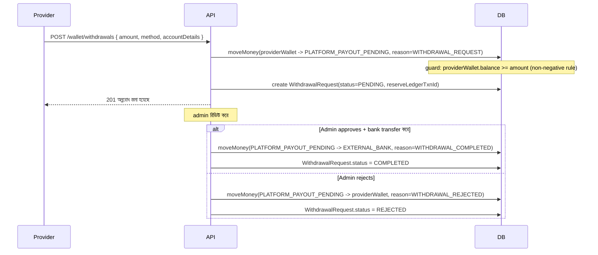
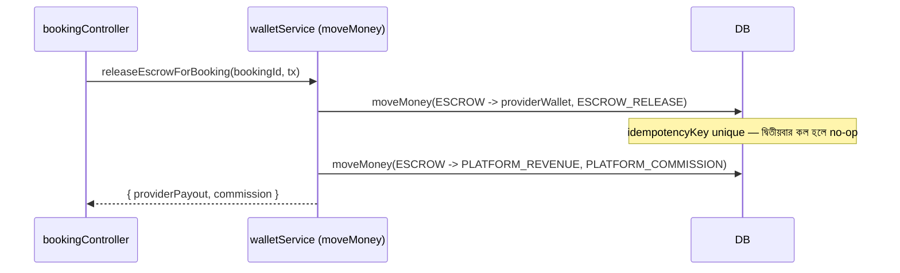

# Wallet Module — Architecture Design (কোড এখনো নেই — approval-এর অপেক্ষায়)

## ⚠️ প্রথমেই একটা কেন্দ্রীয় সিদ্ধান্ত দরকার
বর্তমানে `Wallet`/`WalletTransaction`/`LedgerEntry` (Booking module-এর অংশ, **frozen**) দিয়ে escrow release/refund/commission ইতিমধ্যে atomic+idempotent ভাবে কাজ করছে। Wallet Module সঠিকভাবে ডিজাইন করতে গেলে (double-entry, সব money-movement traceable, provider-agnostic ভবিষ্যৎ) নিচের দুইটা পথ:

- **Option A — Coexistence:** পুরনো `Wallet`/`WalletTransaction` অক্ষত রেখে, নতুন সব কিছুর (withdrawal, admin adjustment, referral bonus, ভবিষ্যতের provider) জন্য নতুন `Account`/`LedgerTransaction` মডেল যোগ করা। **ঝুঁকি:** একই ইউজারের balance দুই জায়গায় (Wallet.balance বনাম Account.balance) থাকবে — যেটা "single source of truth" ভেঙে দেয়, ভবিষ্যতে drift হওয়ার সুযোগ তৈরি করে।
- **Option B — Unify:** `Account`/`LedgerTransaction`-কে একমাত্র সত্যিকারের উৎস বানানো; পুরনো ডেটা migrate করা; আর `walletService.js` (Booking module-এর ফাইল, frozen)-কে নতুন মডেল ব্যবহার করতে সামান্য আপডেট করা। **এটাই সঠিক ডিজাইন**, কিন্তু frozen module-এ হাত দেওয়া লাগবে — যেটা আপনার নিয়ম অনুযায়ী "critical issue" ছাড়া করা যাবে না। তাই এটা করতে হলে আপনার explicit exception approval লাগবে।

নিচের পুরো ডিজাইন **Option B ধরে করা হয়েছে** (আমার সুপারিশ — কারণ Option A নিজেই "double bookkeeping" যেটা এই মডিউলের মূল লক্ষ্যের বিপরীত), কিন্তু বাস্তবায়নের আগে আপনার সিদ্ধান্ত লাগবে। শেষে প্রশ্ন করেছি।

---

## ১. Database Schema

```prisma
enum AccountType {
  USER_WALLET       // প্রতি ইউজারের জন্য একটা (customer বা provider — role যেটাই হোক)
  PLATFORM_ESCROW    // সিস্টেম-ওয়াইড একটা একক row — in-transit টাকা এখানে "হোল্ড" থাকে
  PLATFORM_REVENUE   // সিস্টেম-ওয়াইড একটা একক row — জমে থাকা কমিশন
  PLATFORM_PAYOUT_PENDING // উত্তোলনের অনুরোধ admin approve না হওয়া পর্যন্ত এখানে থাকে
  EXTERNAL_GATEWAY   // বুকিং-কিপিং fiction — গেটওয়ে থেকে টাকা "আসে" এখান থেকে
  EXTERNAL_BANK      // বুকিং-কিপিং fiction — উত্তোলিত টাকা এখানে "চলে যায়" (সিস্টেমের বাইরে)
}

model Account {
  id        String      @id @default(uuid())
  type      AccountType
  userId    String?     @unique // শুধু USER_WALLET-এর জন্য সেট থাকে
  balance   Float       @default(0) // materialized cache — source of truth হলো LedgerTransaction-এর sum
  createdAt DateTime    @default(now())

  @@index([type])
}

enum LedgerReason {
  PAYMENT_CAPTURED     // গেটওয়ে থেকে টাকা escrow-এ ঢুকলো
  ESCROW_RELEASE        // escrow থেকে provider wallet-এ payout
  PLATFORM_COMMISSION   // escrow থেকে platform revenue-তে
  REFUND                // escrow থেকে customer wallet-এ
  WITHDRAWAL_REQUEST    // wallet থেকে payout-pending-এ (reserve)
  WITHDRAWAL_COMPLETED  // payout-pending থেকে external bank-এ
  WITHDRAWAL_REJECTED   // payout-pending থেকে wallet-এ ফেরত
  REFERRAL_BONUS        // platform revenue (বা একটা bonus pool account) থেকে wallet-এ
  CASHBACK              // একইভাবে
  ADMIN_ADJUSTMENT       // ম্যানুয়াল সংশোধন, সবসময় admin userId + কারণ সহ
}

// একমাত্র সত্যিকারের ledger — immutable, append-only। কোনো ভুল হলে নতুন
// reversing entry লেখা হয়, পুরনোটা কখনো edit/delete হয় না।
model LedgerTransaction {
  id             String       @id @default(uuid())
  idempotencyKey String       @unique // deterministic, e.g. "booking:{id}:escrow_release"
  fromAccountId  String
  fromAccount    Account      @relation("From", fields: [fromAccountId], references: [id])
  toAccountId    String
  toAccount      Account      @relation("To", fields: [toAccountId], references: [id])
  amount         Float
  reason         LedgerReason
  bookingId      String?      // নাল হতে পারে — সব transaction বুকিং-নির্ভর না
  initiatedByUserId String?   // admin adjustment হলে কার — audit-এর জন্য
  metadata       Json?
  createdAt      DateTime     @default(now())

  @@index([fromAccountId])
  @@index([toAccountId])
  @@index([bookingId])
  @@index([reason])
}

model WithdrawalRequest {
  id                 String   @id @default(uuid())
  userId             String
  accountId          String   // provider-এর wallet account
  amount             Float
  method             String   // bank_transfer, mobile_banking ইত্যাদি
  accountDetails     String
  status             WithdrawalStatus @default(PENDING)
  reserveLedgerTxnId String   // WITHDRAWAL_REQUEST entry (funds reserved)
  settleLedgerTxnId  String?  // WITHDRAWAL_COMPLETED বা WITHDRAWAL_REJECTED entry
  processedByUserId  String?
  createdAt          DateTime @default(now())
  processedAt        DateTime?

  @@index([userId])
  @@index([status])
}

enum WithdrawalStatus { PENDING PROCESSING COMPLETED REJECTED }
```

**পুরনো `Wallet`/`WalletTransaction`/`LedgerEntry` কী হবে (Option B):** এক-বারের migration script দিয়ে প্রতিটা `Wallet` row-কে `Account(type=USER_WALLET)`-এ, প্রতিটা পুরনো `WalletTransaction`/`LedgerEntry`-কে সংশ্লিষ্ট `LedgerTransaction`-এ রূপান্তর করা হবে (historical continuity বজায় রেখে)। এরপর `walletService.js` নতুন মডেল ব্যবহার করবে। পুরনো টেবিল দুটো ডিলিট না করে কিছুদিন রেখে দেওয়া ভালো (rollback safety)।

---

## ২. Wallet Types
এই ডিজাইনে "wallet type" আলাদা মডেল না — `Account.type = USER_WALLET` সবার জন্য এক, কারণ:
- একজন ইউজারের role (CUSTOMER/PROVIDER) বদলাতে পারে (যদিও এখন হয় না) এবং একটাই wallet balance থাকা স্বাভাবিক
- customer wallet-এ আসে: refund, cashback, referral bonus
- provider wallet-এ আসে: booking payout
- দুটোই একই `USER_WALLET` account, শুধু কোন `LedgerReason` দিয়ে টাকা এসেছে সেটা আলাদা

সিস্টেম-লেভেল account (PLATFORM_ESCROW, PLATFORM_REVENUE ইত্যাদি) প্রতিটার ঠিক **একটাই row** থাকবে (singleton), bootstrap migration-এ তৈরি হবে।

---

## ৩. Ledger Design (Double-Entry)

প্রতিটা টাকার movement মানে টাকা এক account থেকে আরেক account-এ যায় — কখনো "তৈরি" বা "ধ্বংস" হয় না, শুধু system-এর ভেতরে বা বাইরে move করে। এটাই double-entry-র মূল নীতি প্রয়োগ করা হয়েছে (classic debit/credit column-এর বদলে from/to account — কার্যত সমতুল্য, এই স্কেলের জন্য সহজ):

| Event | From | To |
|---|---|---|
| গেটওয়ে থেকে টাকা আসে | EXTERNAL_GATEWAY | PLATFORM_ESCROW |
| Escrow release (payout) | PLATFORM_ESCROW | Provider USER_WALLET |
| Escrow release (commission) | PLATFORM_ESCROW | PLATFORM_REVENUE |
| Refund | PLATFORM_ESCROW | Customer USER_WALLET |
| Withdrawal request | Provider USER_WALLET | PLATFORM_PAYOUT_PENDING |
| Withdrawal সম্পন্ন | PLATFORM_PAYOUT_PENDING | EXTERNAL_BANK |
| Withdrawal প্রত্যাখ্যাত | PLATFORM_PAYOUT_PENDING | Provider USER_WALLET |
| Referral bonus | PLATFORM_REVENUE | Customer/Provider USER_WALLET |

**যাচাইযোগ্যতা:** যেকোনো মুহূর্তে সব account-এর balance যোগ করলে শূন্য হওয়া উচিত (EXTERNAL_* account-গুলো ব্যতিক্রম, ওগুলো সিস্টেমের বাইরের প্রতিনিধিত্ব করে, ইচ্ছাকৃতভাবে ঋণাত্মক/ধনাত্মক অসীমের দিকে যেতে পারে) — এটা একটা periodic reconciliation script দিয়ে যাচাই করা যায় (balance-integrity check, নিচে Scalability Review-এ আছে)।

**Traceability:** `Account.balance` = `SUM(toAccountId=this)` − `SUM(fromAccountId=this)` — সবসময় derivable, ledger-ই source of truth।

---

## ৪. Transaction Flow (একটা একক core function)

সব wallet operation একটাই ফাংশনের মধ্য দিয়ে যাবে:

```
moveMoney({ fromAccountId, toAccountId, amount, reason, idempotencyKey, bookingId?, metadata? }, tx)
```

ধাপ (সব একটা `prisma.$transaction`-এর ভেতরে):
1. `tx.ledgerTransaction.create({ idempotencyKey, ... })` — `idempotencyKey` unique constraint-এ আঘাত করলে (P2002) মানে এই operation আগেই হয়ে গেছে, চুপচাপ আগের entry রিটার্ন করে দেয় (idempotent)
2. `fromAccount`-এ non-negative guard (নিচে দেখুন) সহ conditional `updateMany` দিয়ে balance কমানো
3. guard fail করলে পুরো transaction throw করে rollback (ধাপ ১-ও বাতিল)
4. `toAccount`-এর balance বাড়ানো (increment, guard লাগে না — বাড়ানো কখনো negative করে না)

---

## ৫. Withdrawal Workflow


টাকা request-এর মুহূর্তেই wallet থেকে সরে যায় (double-withdraw impossible — balance guard-এর কারণে), `PLATFORM_PAYOUT_PENDING`-এ "বসে" থাকে যতক্ষণ না admin সিদ্ধান্ত নেয়।

---

## ৬. Commission Workflow
Escrow release-এর মুহূর্তে **একটা `moveMoney` কল না, দুইটা** — একই `prisma.$transaction`-এর ভেতরে:
1. `moveMoney(ESCROW -> providerWallet, amount=payout, reason=ESCROW_RELEASE, idempotencyKey="booking:{id}:release")`
2. `moveMoney(ESCROW -> PLATFORM_REVENUE, amount=commission, reason=PLATFORM_COMMISSION, idempotencyKey="booking:{id}:commission")`

দুটো আলাদা idempotencyKey — মানে release হয়ে commission fail করলে (theoretically) সেটা আলাদাভাবে retry-safe, কিন্তু যেহেতু একই outer transaction-এ, বাস্তবে দুটো একসাথে সফল বা একসাথে rollback হবে।

---

## ৭. Escrow Integration
**গুরুত্বপূর্ণ উন্নতি (Option B-তে):** বর্তমান সিস্টেমে "payment captured into escrow"-এর কোনো ledger entry নেই — শুধু release/refund লগ হয়। নতুন ডিজাইনে webhook/callback confirm করার মুহূর্তেই `moveMoney(EXTERNAL_GATEWAY -> PLATFORM_ESCROW, reason=PAYMENT_CAPTURED)` লেখা হবে — তাহলে পুরো lifecycle (capture → hold → release/refund) সম্পূর্ণ traceable হয়ে যায়, যেটা এখন নেই।

---

## ৮. Refund Flow
`moveMoney(PLATFORM_ESCROW -> customerWallet, reason=REFUND, idempotencyKey="booking:{id}:refund")` — booking cancel/reject/expire/dispute-refund সব একই path দিয়ে যায় (Booking module-এর `refundEscrowForBooking` internally এটা কল করবে)।

---

## ৯. API List

| Method | Path | Auth | নোট |
|---|---|---|---|
| GET | `/api/wallet/me` | self | balance + paginated transaction history (বর্তমানে unpaginated, ঠিক হবে) |
| GET | `/api/wallet/transactions` | self | `LedgerTransaction` থেকে, cursor-paginated |
| POST | `/api/wallet/withdrawals` | provider, blockGuest | নতুন `WithdrawalRequest` তৈরি |
| GET | `/api/wallet/withdrawals/me` | self | নিজের উত্তোলনের ইতিহাস |
| GET | `/api/admin/withdrawals/pending` | admin | বিদ্যমান, নতুন মডেলে migrate |
| PATCH | `/api/admin/withdrawals/:id/process` | admin | approve/reject |
| POST | `/api/admin/wallet/adjustment` | admin | নতুন — ম্যানুয়াল সংশোধন (কারণ mandatory, `ADMIN_ADJUSTMENT` reason, `initiatedByUserId` ট্র্যাক হয়) |
| GET | `/api/admin/ledger` | admin | filterable ledger browser (debugging/support-এর জন্য) |

---

## ১০. Sequence Diagram — Escrow Release (Wallet Module দৃষ্টিকোণ থেকে)



---

## ১১. Security Review

| # | ঝুঁকি | Mitigation |
|---|---|---|
| ১ | Negative balance | প্রতিটা `moveMoney`-তে `fromAccount` conditional guard (`balance >= amount`) — শুধু `EXTERNAL_*` account exempt |
| ২ | Double-processing (retry/race) | `idempotencyKey` unique constraint — DB-level guarantee, শুধু application logic-এর উপর নির্ভর না |
| ৩ | Admin adjustment abuse | সবসময় `initiatedByUserId` + `reason` mandatory, immutable ledger — কোনো adjustment "লুকানো" যাবে না |
| ৪ | পুরনো `processWithdrawal` (adminController.js)-এ TOCTOU race আছে (status check + write আলাদা) | এই migration-এর সময়ই ফিক্স হয়ে যাবে (guarded `WithdrawalRequest` transition) |
| ৫ | Ledger row edit/delete | মডেল-লেভেলে কোনো update endpoint থাকবে না কোড-এ — ভুল হলে reversing entry, কখনো mutate না |

---

## ১২. Scalability Review

| বিষয় | ডিজাইন |
|---|---|
| Millions of transactions | `LedgerTransaction` append-only, `fromAccountId`/`toAccountId`/`bookingId`/`reason`-এ index — balance history query fast থাকবে |
| Balance read latency | `Account.balance` materialized cache, প্রতি read-এ sum করতে হয় না |
| Balance integrity check | Periodic job (যেমন daily): `Account.balance` বনাম `SUM(ledger)` — mismatch হলে alert (drift ধরার জন্য, না ঠিক করার জন্য — auto-fix ঝুঁকিপূর্ণ) |
| নতুন payment provider | `EXTERNAL_GATEWAY` একটাই generic account — কোন গেটওয়ে থেকে এসেছে সেটা `LedgerTransaction.metadata`-তে থাকে, নতুন গেটওয়ে যোগ করতে কোনো schema পরিবর্তন লাগে না |
| Pagination | সব list endpoint cursor/offset paginated (বর্তমান `getMyWallet`-এর unpaginated ১০০-লিমিট ঠিক হবে) |
| Table growth | `LedgerTransaction` কখনো ছোট হবে না (append-only) — বছর কয়েক পর partitioning (by `createdAt`) বিবেচনা করা যেতে পারে, এখনই দরকার না |

---

## চূড়ান্ত সিদ্ধান্ত দরকার

1. **Option A না B?** (উপরে) — B সুপারিশ করছি কিন্তু frozen Booking module-এ (`walletService.js`) সামান্য টাচ করতে হবে
2. Referral bonus/cashback-এর টাকা `PLATFORM_REVENUE` থেকে যাবে, নাকি আলাদা `PLATFORM_MARKETING_POOL` account রাখব (accounting-এ পরিষ্কার থাকার জন্য)?
